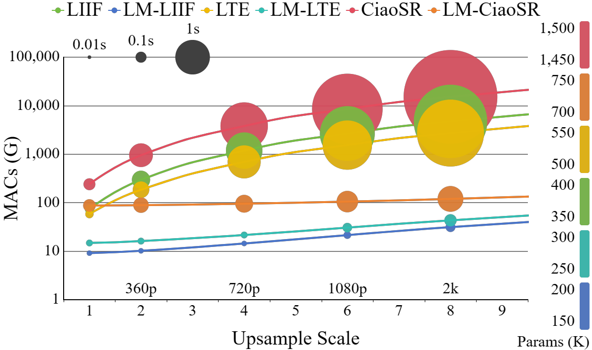
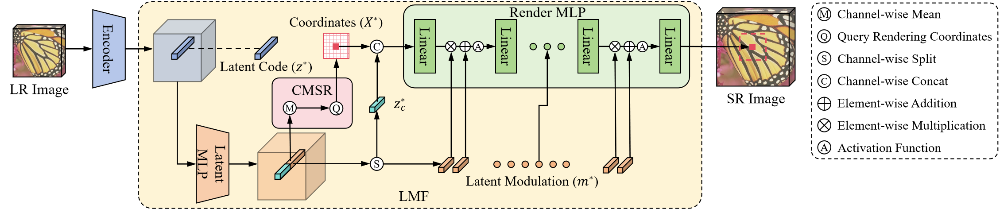

<div align="center">
<h1>Latent Modulated Function for Computational Optimal Continuous Image Representation</h1>
<br>
<a href="https://github.com/HeZongyao">Zongyao He</a><sup><span>1</span></sup>, 
<a href="https://ise.sysu.edu.cn/teacher/teacher02/1384977.htm">Zhi Jin</a><sup><span>1,Corresponding author</span></sup>

<sup>1</sup> SUN YAT-SEN University
<br>
<div>

[](https://github.com/HeZongyao/LMF)
[](https://arxiv.org/abs/2404.16451)
[](https://openaccess.thecvf.com/content/CVPR2024/html/He_Latent_Modulated_Function_for_Computational_Optimal_Continuous_Image_Representation_CVPR_2024_paper.html)
[](https://opensource.org/licenses/Apache-2.0)

</div>
</div>


## Introduction

This repository contains the official PyTorch implementation for the CVPR 2024 Highlight paper titled "Latent Modulated Function for Computational Optimal Continuous Image Representation" by Zongyao He and Zhi Jin.

<div align="center">
  
  <br>

  Efficiency comparisons (320 × 180 input) for Arbitrary-Scale Super-Resolution
</div>

<div align="center">
  
  <br>

  Framework of our LMF-based continuous image representation
</div>


## Abstract

The recent work Local Implicit Image Function (LIIF) and subsequent Implicit Neural Representation (INR) based works have achieved remarkable success in Arbitrary-Scale Super-Resolution (ASSR) by using MLP to decode Low-Resolution (LR) features. However, these continuous image representations typically implement decoding in High-Resolution (HR) High-Dimensional (HD) space, leading to a quadratic increase in computational cost and seriously hindering the practical applications of ASSR. 

To tackle this problem, we propose a novel Latent Modulated Function (LMF), which decouples the HR-HD decoding process into shared latent decoding in LR-HD space and independent rendering in HR Low-Dimensional (LD) space, thereby realizing the first computational optimal paradigm of continuous image representation. Specifically, LMF utilizes an HD MLP in latent space to generate latent modulations of each LR feature vector. This enables a modulated LD MLP in render space to quickly adapt to any input feature vector and perform rendering at arbitrary resolution. Furthermore, we leverage the positive correlation between modulation intensity and input image complexity to design a Controllable Multi-Scale Rendering (CMSR) algorithm, offering the flexibility to adjust the decoding efficiency based on the rendering precision.

Extensive experiments demonstrate that converting existing INR-based ASSR methods to LMF can reduce the computational cost by up to **99.9%**, accelerate inference by up to **57×**, and save up to **76%** of parameters, while maintaining competitive performance.


## Requirements
Ensure your environment meets the following prerequisites:

- **Python**: >= 3.8

- **PyTorch**:  >= 1.9.1


## Quick Start
### 1. Download Pre-trained Models：
- **Pre-existing Models**: We provide LM-LIIF (EDSR-b) and LM-LTE (EDSR-b) models in the `./save/pretrained_models` folder.
- **Additional Models**: Download more pre-trained models from [this google drive link](https://drive.google.com/drive/folders/115AUj4Axh0VBmmozwxRIWqrNR5ZdWzd4?usp=drive_link).
- **Original Method Models**: You can download the pre-trained models of the original methods in their repos ( [LIIF](https://github.com/yinboc/liif), [LTE](https://github.com/jaewon-lee-b/lte), [CiaoSR](https://github.com/caojiezhang/CiaoSR)).

### 2. Download Benchmark Datasets:
Download the benchmark datasets from [EDSR-PyTorch Repository](https://github.com/sanghyun-son/EDSR-PyTorch) and store them in the `./load` folder. The benchmark datasets include:
- Set5
- Set14
- BSD100
- Urban100

### 3. Testing

- **Test on a Single Image**:
  ```bash
  python demo.py --input demo.png --scale 4 --output demo_x4.png --model save/pretrained_models/edsr-b_lm-liif.pth --gpu 0 --fast True
  ```

- **Test on a Testset**:
  ```bash
  python test.py --config configs/test-lmf/test-set5.yaml --model save/pretrained_models/edsr-b_lm-liif.pth --gpu 0 --fast True
  ```


## Training & Testing

### 1. Download Training Dataset
- **DIV2K Dataset**: Download from the [DIV2K official website](https://data.vision.ee.ethz.ch/cvl/DIV2K/) and place the files in the `./load` folder. Both DIV2K_train_HR and DIV2K_valid_HR are needed.

### 2. Train Your Model
- **Command to Start Training**:
  ```bash
  python train.py --config configs/train-lmf/train_edsr-baseline-lmliif.yaml --gpu 0 --name edsr-b_lm-liif
  ```
- **Configuration Details**: Configuration files for different LMF-based models are located in `./configs/train-lmf`. Each configuration file details the model settings and hyperparameters.
- **Output**: Trained models and logs will be saved in the `./save` folder.

### 3. Evaluation
- **Evaluate without CMSR**:
  ```bash
  python test.py --config configs/test-lmf/test-div2k-x2.yaml --model save/pretrained_models/edsr-b_lm-liif.pth --gpu 0 --fast True
  ```
  - **Configuration Details**: Modify the configuration files in the `./configs/test-lmf` folder to evaluate on different testsets and scale factors.
  - **Output**: The SR images are stored in the `./output` folder.

- **Evaluate with CMSR**:
  - **Generate Scale2Mod Table**:
    Multiple commands are needed for initializing CMSR at various scales. Here's an example for scale x2:
    ```bash
    python init_cmsr.py --config configs/cmsr/init-div2k-x2.yaml --model edsr-b_lm-liif.pth --gpu 0 --mse_threshold 0.00002 --save_path configs/cmsr/result/edsr-b_lm-liif_2e-5.yaml
    ```
    Repeat the above command with different scales as needed. Usually scales x2, x3, x4, x6, x12, x18 are dense enough for ASSR. 

  - **Evaluate with CMSR Enabled**:
    ```bash
    python test.py --config configs/test-lmf/test-div2k-x8.yaml --model edsr-b_lm-liif.pth --gpu 0 --fast True --cmsr True --cmsr_mse 0.00002 --cmsr_path configs/cmsr/result/edsr-b_lm-liif_2e-5.yaml
    ```


## TODO

- [x] Release the paper on [ArXiv](https://arxiv.org/abs/2404.16451).
- [x] Release the code for Latent Modulated Function (LMF).
- [x] Release more pre-trained models and evaluation results.


## Acknowledgement

This work was supported by [Frontier Vision Lab](https://fvl2020.github.io/fvl.github.com/), SUN YAT-SEN University.

Special acknowledgment goes to the following projects: [LIIF](https://github.com/yinboc/liif), [LTE](https://github.com/jaewon-lee-b/lte), [CiaoSR](https://github.com/caojiezhang/CiaoSR), and [DIIF](https://github.com/HeZongyao/DIIF).


## Citation

If you find this work helpful, please consider citing:

```
@InProceedings{He_2024_CVPR,
    author={He, Zongyao and Jin, Zhi},
    title={Latent Modulated Function for Computational Optimal Continuous Image Representation},
    booktitle={Proceedings of the IEEE/CVF Conference on Computer Vision and Pattern Recognition (CVPR)},
    month={June},
    year={2024},
    pages={26026-26035}
}
```

Feel free to reach out for any questions or issues related to the project. Thank you for your interest!
